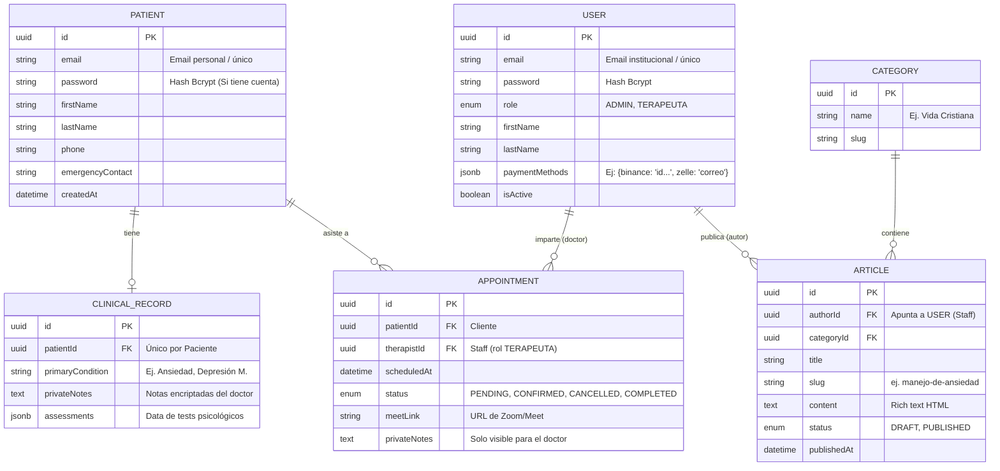

# Modelo Entidad-Relación (ER) - Psicoeducándonos

Este documento ilustra y define la base de datos relacional para el sistema, utilizando la separación de responsabilidades entre el **Staff (Usuarios del panel)** y los **Clientes (Pacientes públicos)**.

## Resumen de Reglas de Negocio
1. **Separación de Identidad:** Un `PATIENT` nunca puede acceder al panel administrativo, por diseño su inicio de sesión irá a otra tabla. 
2. **Historias Clínicas:** Extraídas en un modelo `1:1` con el `PATIENT` para que los datos extremadamente sensibles puedan tener políticas de encriptación separadas.
3. **Citas (Appointments):** Actúan como la tabla pivote de actividad. Requieren obligatoriamente la existencia de un `USER` (Doctor) y un `PATIENT` (Cliente).
